# TalentGraph AI — System Architecture & Engineering Roadmap
### Explainable Multi-Stage Semantic Candidate Ranking Engine

This document locks in the system architecture and breaks it into 15 independently-implementable phases, each ending in a working milestone. Locked-in model stack: **Qwen3-Embedding** (dense retrieval) + **Qwen3-Reranker** (cross-encoder), with structured-JD-understanding handled offline (any model, including Claude, is fine here — see Section 0).

---

## 0. Official Challenge Constraints — Read This First

*(Added once the real bundle — `job_description.docx`, `submission_spec.docx`, `redrob_signals_doc.docx`, `candidate_schema.json`, `validate_submission.py` — was available. This section overrides anything below it that conflicts.)*

**The deliverable, precisely:** rank all 100,000 candidates in `candidates.jsonl` against one fixed job description ("Senior AI Engineer — Founding Team," Redrob AI), and submit exactly 100 rows (`candidate_id,rank,score,reasoning`) via a single reproducible command, e.g. `python rank.py --candidates ./candidates.jsonl --out ./submission.csv`. Always validate with the organizer's own `validate_submission.py` before treating anything as done.

**Hard compute budget for the ranking step itself (enforced at Stage 3 via sandboxed reproduction):**

| Constraint | Limit |
|---|---|
| Wall-clock runtime | ≤ 5 minutes |
| Memory | ≤ 16 GB RAM |
| Compute | CPU only — no GPU |
| Network | Off — zero hosted LLM/API calls (no Claude, GPT, Gemini, Cohere, or any hosted service) |
| Disk (intermediate state) | ≤ 5 GB |

This splits the architecture into two phases, not one continuous pipeline:

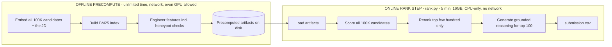

Phases 5-9 below are still valid — they just run in the **offline** box (any model, any amount of time, network is fine). Only the final pass that actually produces `submission.csv` needs to fit in the **online** box. The original Phase-10 plan to call Claude/Qwen during explanation generation is **not valid for the graded ranking step** — see the revised Phase 10. (Using Claude or any AI tool as a *development* tool while building this is fine and expected — declare it honestly in `submission_metadata.yaml`; it just can't be a runtime dependency of `rank.py`.)

**Two gradeable traps in the dataset:**
- **Keyword-stuffer trap** — candidates with AI-keyword-dense skill lists but unrelated titles/careers (e.g. an HR Manager listing 9 AI skills). `sample_submission.csv` is a format reference only, and its own top rows are actually an example of falling into this trap — don't pattern-match its logic.
- **~80 honeypots** — internally-inconsistent profiles (e.g. "expert" proficiency with `duration_months: 0`). Honeypot rate >10% in your top 100 is an automatic Stage-3 disqualification, independent of ranking quality.

**Final scoring formula** (revealed only after submissions close — build your own offline eval harness against this exact formula, see revised Phase 11):

`Final composite = 0.50 × NDCG@10 + 0.30 × NDCG@50 + 0.15 × MAP + 0.05 × P@10`

**Also required at submission:** a working sandbox link (HuggingFace Spaces, Streamlit Cloud, Replit, Colab, or a public Docker image) running your ranker on a ≤100-candidate sample within the same budget; a GitHub repo with genuine iterative commit history; `requirements.txt`; `submission_metadata.yaml` at repo root. Maximum 3 submissions — your last valid one counts.

---

## 1. System Architecture

### 1.1 High-Level Architecture

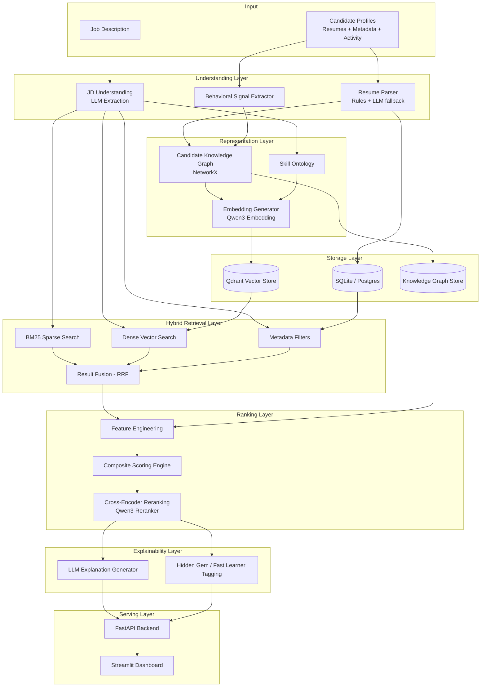

### 1.2 Runtime Data Flow (single ranking request)

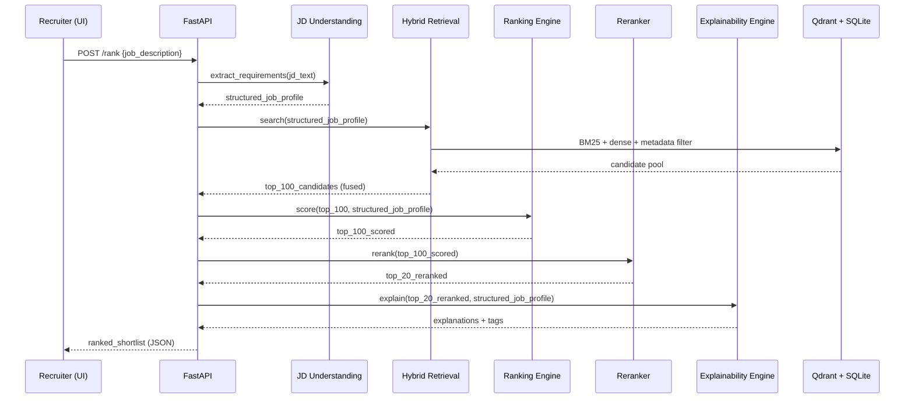

### 1.3 Embedding Pipeline

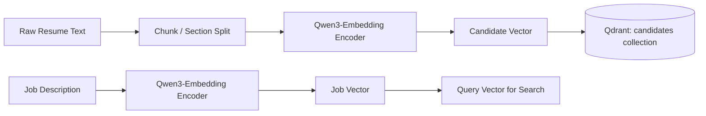

### 1.4 Hybrid Retrieval Pipeline

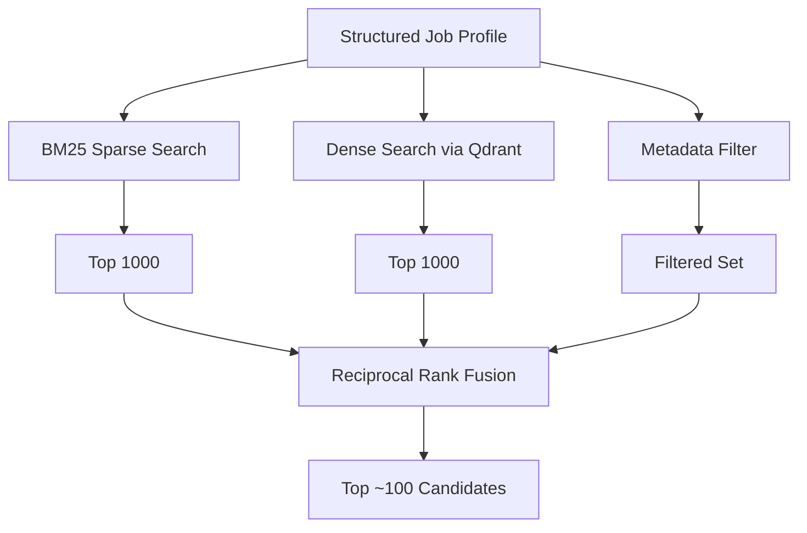

### 1.5 Ranking & Reranking Pipeline

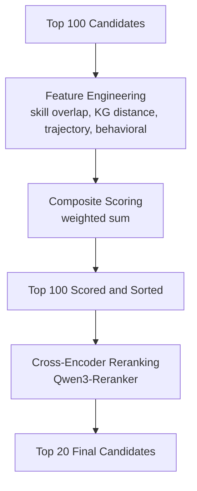

### 1.6 Explainability Layer

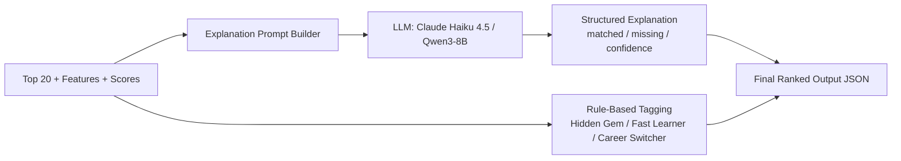

### 1.7 Storage Architecture

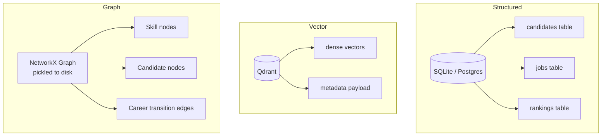

### 1.8 API Architecture

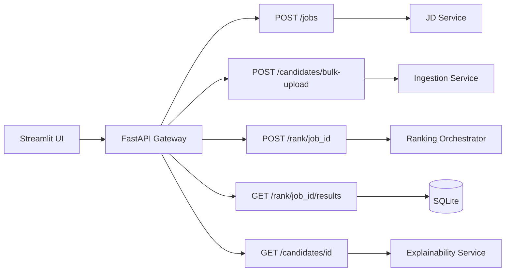

### 1.9 Deployment Architecture

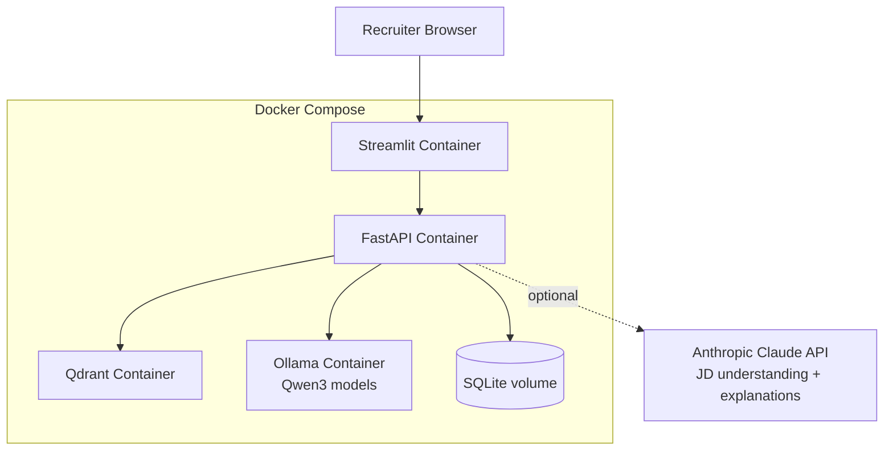

---

## 2. Technology Stack — Locked In

| Layer | Choice | Why |
|---|---|---|
| Language | Python 3.12+ | Standard for this ecosystem |
| API | FastAPI | Async, auto-docs, pydantic-native |
| LLM (reasoning) | Pluggable: Ollama `qwen3:8b` (local) **or** Claude Haiku 4.5 / Sonnet 4.6 (API) | Low call volume (per-job, per-explanation) — API cost/latency is negligible here, but local keeps the demo offline-safe |
| Embeddings | Qwen3-Embedding-0.6B / 4B | Apache-2.0, MTEB-competitive, instruction-aware, flexible 32–1024 dim output |
| Vector DB | Qdrant | Native hybrid (dense+sparse) search, payload filtering, easy local Docker |
| Sparse retrieval | `rank-bm25` | Lightweight, no extra service needed |
| Reranker | Qwen3-Reranker-0.6B / 4B | Same family as embeddings, Apache-2.0, strong published benchmarks |
| Graph | NetworkX (in-memory, pickled) | Zero-infra, sufficient at hackathon scale; Neo4j only if graph grows large |
| Structured data | SQLite (Postgres optional) | Zero-setup, file-based, fine for hackathon scale |
| Data processing | pandas / polars | Standard tooling |
| Frontend | Streamlit (React optional stretch) | Fastest path to a working demo UI |
| Containerization | Docker + Docker Compose | One-command, judge-proof demo |
| Testing | pytest | Standard |
| Eval metrics | hand-rolled NDCG/MRR/Precision@k | Full control + explainability for the README |

---

## 3. Repository Structure

```
candidate-ranking-ai/
│
├── data/
│   ├── raw/
│   ├── processed/
│   ├── embeddings/
│   └── knowledge_graph/
│
├── common/                  # Settings, LLMProvider interface, shared utils
├── config/                  # Scoring weights, ontology config, env templates
├── ingestion/
├── preprocessing/
├── parsers/
├── feature_engineering/
├── embeddings/
├── retrieval/
├── reranking/
├── ranking_engine/
├── explainability/
├── evaluation/
├── api/
├── frontend/
├── scripts/                 # seed_data.sh, export_ranked_output.py, healthcheck.sh
├── experiments/
├── notebooks/
├── tests/
├── docs/                    # architecture.md (this doc's diagrams), data_dictionary.md
└── deployment/
    ├── docker-compose.yml
    ├── api.Dockerfile
    └── frontend.Dockerfile
```

---

## 4. Phase-Wise Roadmap

### Phase 1 — Foundations: Architecture, Stack & Repo Setup

**Objective:** Establish the project skeleton, tooling, environment, and config so every later phase has a stable base.
**Why this phase exists:** Locks in interfaces (the `LLMProvider` abstraction, settings management) that every later phase depends on — re-architecting mid-hackathon is the most common cause of lost time.
**Inputs → Outputs:** None → a booted skeleton: repo structure, `.env` config, Docker Compose (Qdrant + Ollama), base FastAPI app with `/health`, pytest scaffold, lint config.
**Data model:** `Settings(BaseSettings)`; `LLMProvider(Protocol)` with `generate(prompt: str) -> str`.
**Classes:** `OllamaProvider`, `ClaudeProvider` (both implement `LLMProvider`); `get_llm_provider(name)` factory.
**Functions:** `get_settings()`, health check handler.
**Algorithms:** None this phase.
**Libraries:** fastapi, uvicorn, pydantic-settings, python-dotenv, qdrant-client, anthropic, ollama, pytest, ruff, black.
**Testing:** unit test settings load from `.env`; unit test provider factory returns the right implementation; integration test `docker compose up` → `GET /health` returns 200.
**Edge cases:** missing API key falls back to Ollama; Ollama not running raises a clear, actionable error (not a silent hang).
**Performance considerations:** N/A this phase.
**Acceptance criteria (milestone):** `docker compose up` brings up Qdrant + Ollama + API; `pytest` passes; `/health` returns 200.
**Possible improvements:** GitHub Actions CI running lint + tests on push.
**Estimated complexity:** Low (0.5–1 day).

---

### Phase 2 — Dataset Exploration, Schema Analysis & Cleaning *(updated against the real bundle)*

**Objective:** Load and validate the real 100,000-row `candidates.jsonl` against the official `candidate_schema.json`, and structure the one fixed job description into the same shape your scoring engine expects.
**Why this phase exists:** every later phase depends on this exact schema — there's no generic "candidate dataset," there's this one, with this exact shape, already fully specified for you.
**Real data shape (from `candidate_schema.json` / `sample_candidates.json`):**
- `candidate_id`: `CAND_XXXXXXX` (7-digit, regex-validated)
- `profile`: anonymized_name, headline, summary, location, country, years_of_experience, current_title, current_company, current_company_size (banded enum), current_industry
- `career_history[]` (1-10 entries): company, title, start_date, end_date, duration_months, is_current, industry, company_size, description
- `education[]` (0-5 entries): institution, degree, field_of_study, start_year, end_year, grade, tier (tier_1..tier_4/unknown)
- `skills[]`: name, proficiency (beginner/intermediate/advanced/expert), endorsements, duration_months
- `certifications[]`, `languages[]` (optional)
- `redrob_signals`: 23-field behavioral object — full mapping in the revised Phase 7
**Inputs → Outputs:** `candidates.jsonl` (100K lines, ~487MB) + `job_description.docx` (structured once into a `JobRecord`) → `data/processed/candidates.parquet`, `data/processed/job_redrob_senior_ai_engineer.json`.
**Classes:** `CandidateSchemaValidator` (pydantic model generated directly from `candidate_schema.json` rather than hand-rolled, to guarantee it matches exactly), `JDStructurer`.
**Functions:** `stream_jsonl(path)` (read line-by-line — never `json.load` the whole 487MB file at once, the README's own loading example streams it), `flatten_candidate(record)` (career_history/skills/education arrays → engineered scalars for fast downstream scoring, e.g. `total_career_months`, `num_employers`, `current_role_ai_relevant: bool`), `validate_against_schema(record)`.
**Algorithms:** streaming JSONL parse + incremental DataFrame build (or polars' native JSONL reader).
**Libraries:** polars (handles 100K rows comfortably), pydantic, python-docx (for the JD text).
**Testing:** confirm all 100,000 records load and validate (any failure = a misunderstood field, flag rather than silently drop); spot-check flattened features against 5 records read by hand.
**Edge cases:** `end_date: null` for current roles (expected); `github_activity_score: -1` and `offer_acceptance_rate: -1` are sentinel "no data" values, not real scores — must not be treated as 0 or as a real negative score.
**Performance considerations:** streaming + polars should process all 100K rows in well under a minute; this is offline, not part of the 5-minute online budget.
**Acceptance criteria (milestone):** all 100,000 candidates load, validate, and flatten without error; the JD is structured into the same shape your Phase 8 scorer expects.
**Possible improvements:** cache the flattened parquet so every dev iteration skips re-parsing the 487MB file.
**Estimated complexity:** Low–Medium (0.5 day — the schema is fully specified, no guesswork needed).

---

### Phase 3 — Resume & Job Description Parsing

**Objective:** Convert cleaned, unstructured text into structured intermediate representations (sections, skills, experience entries, requirements) using a hybrid rules + LLM approach.
**Why this phase exists:** Pure LLM parsing of every resume is slow/costly at scale; a hybrid parser is more robust and far cheaper, while still using the LLM where it earns its keep — the harder, lower-volume JD extraction.
**Inputs → Outputs:** cleaned text (Phase 2) → `ParsedResume` and `ParsedJob` JSON objects.
**Data model:** `ParsedResume(candidate_id, sections, raw_skills, experience_entries: List[ExperienceEntry(title, company, start, end, description)])`; `ParsedJob(job_id, title, seniority, must_have, nice_to_have, responsibilities, raw_text)`.
**Classes:** `ResumeSectionSplitter`, `ExperienceExtractor`, `JDStructuredExtractor` (calls the Phase-1 `LLMProvider` with a strict JSON-schema prompt).
**Functions:** `split_sections(text)`, `extract_experience_entries(section_text)`, `llm_extract_job_requirements(jd_text)` with retry-on-invalid-JSON and pydantic repair.
**Algorithms:** heading-detection regex/keyword heuristics; date-range parsing (dateparser) to compute role tenure; schema-constrained LLM extraction with validation retry.
**Libraries:** regex, dateparser, pydantic, the Phase-1 `LLMProvider`.
**Testing:** unit tests with synthetic messy resumes (no headers, bullet-only, non-chronological); test that JD extraction always returns schema-valid output even on malformed LLM JSON.
**Edge cases:** resumes with no section headers; ambiguous seniority language; multi-language resumes; skills-only resumes with no narrative.
**Performance considerations:** resume parsing is mostly rule-based (no per-resume LLM call by default); LLM is called once per job, so latency there is acceptable even via API.
**Acceptance criteria (milestone):** ≥95% of sample resumes parse with skills + ≥1 experience entry with no manual fixes; 100% of test JDs return schema-valid structured output.
**Possible improvements:** small fine-tuned classifier for section detection if rule-based splitting underperforms on real data.
**Estimated complexity:** Medium (1–1.5 days).

---

### Phase 4 — Skill Ontology, Knowledge Graph & Career Representation

**Objective:** Build a normalized skill taxonomy and a knowledge graph connecting candidates, skills, roles, and career transitions.
**Why this phase exists:** This is the differentiator judges explicitly call out — generic embedding+cosine pipelines don't reason about skill relationships or career trajectory. This is what enables "hidden gem" and "career switcher" detection.
**Inputs → Outputs:** `ParsedResume`/`ParsedJob` (Phase 3) → `skill_ontology.json`, `candidate_kg.gpickle`.
**Data model:** graph nodes = `{Candidate, Skill, Role, Company, Industry}`; edges = `{HAS_SKILL(weight), WORKED_AS, TRANSITIONED_FROM_TO, SKILL_IMPLIES}` (e.g. Redis → Caching).
**Classes:** `SkillOntologyBuilder`, `KnowledgeGraphBuilder`, `CareerTrajectoryAnalyzer`.
**Functions:** `normalize_skill(raw)` (synonym dict + fuzzy + embedding-NN fallback for unseen skills), `build_skill_graph(ontology)`, `add_candidate_to_graph(graph, parsed_resume)`, `compute_trajectory_vector(candidate)`.
**Algorithms:** synonym resolution (curated dict + rapidfuzz + embedding nearest-neighbor fallback); BFS shortest-path "skill distance" between a candidate's skill and a required one (0 = exact, 1 = direct implication, 2 = same family); simple sequence-based trajectory alignment from career history.
**Libraries:** networkx, rapidfuzz, Qwen3-Embedding (for unseen-skill fallback).
**Testing:** unit tests on `normalize_skill` with typo/synonym cases; test skill-distance traversal returns expected hop counts for known pairs.
**Edge cases:** completely unseen skills (cold start); circular implication edges; very short or very long career histories.
**Performance considerations:** graph should comfortably fit in memory at hackathon scale; persist via pickle so it isn't rebuilt per API call.
**Acceptance criteria (milestone):** ontology covers ≥90% of dataset skills without manual fallback; skill-distance lookup works for any pair, including unseen skills.
**Possible improvements:** migrate to Neo4j if the graph grows past a few hundred thousand nodes.
**Estimated complexity:** Medium–High (1.5–2 days) — worth the extra time, this is your headline differentiator.

---

### Phase 5 — Embedding Pipeline

**Objective:** Generate dense vector representations for candidates and jobs with Qwen3-Embedding and load them into Qdrant.
**Why this phase exists:** Powers the semantic half of hybrid retrieval — without it, you're back to keyword matching.
**Inputs → Outputs:** Phases 3–4 outputs → populated Qdrant `candidates` collection.
**Data model:** Qdrant point = `{id, vector (1024-dim or truncated), payload: {skills, seniority, location, experience_years, kg_node_id}}`.
**Classes:** `EmbeddingService` (wraps Qwen3-Embedding), `QdrantIndexer`.
**Functions:** `build_candidate_text(parsed_resume)` (skills + recent roles + summary, weighted toward recency), `embed_candidate(...)`, `embed_job(...)`, `upsert_candidates(batch)`, `search_by_vector(query_vector, top_k, filters)`.
**Algorithms:** Matryoshka dimension truncation (32–1024 dims) for speed/storage trade-off; Qwen3's recommended instruction-prefixing for retrieval quality.
**Libraries:** sentence-transformers / transformers, qdrant-client, numpy.
**Testing:** unit test embedding dimension matches config; test near-duplicate resumes produce cosine similarity > 0.9; integration test an indexed candidate is retrievable by its own job-equivalent query.
**Edge cases:** empty/near-empty resume text (fallback to skills-only string); resumes exceeding model context (chunk + mean-pool, or truncate to most recent N years).
**Performance considerations:** batch-embed, never one-at-a-time; this is an offline/batch job, not on the live request path.
**Acceptance criteria (milestone):** 100% of cleaned candidates embedded and indexed; a known "obvious match" job retrieves its obvious candidate in the top 10 of pure dense search.
**Possible improvements:** benchmark against Gemini Embedding 001 (current MTEB #1) if API budget allows.
**Estimated complexity:** Medium (1 day).

---

### Phase 6 — Hybrid Retrieval (BM25 + Dense + Metadata Filtering)

**Objective:** Fuse sparse keyword search, dense semantic search, and hard metadata filters into a single top-~100 candidate shortlist before expensive reranking.
**Why this phase exists:** Dense search alone misses exact "must-have" keywords; BM25 alone misses semantic fit; fusing both plus hard filters gives recall and precision cheaply.
**Inputs → Outputs:** structured job profile + Qdrant index → ranked ~100 candidate IDs with per-channel scores.
**Data model:** `RetrievalResult(candidate_id, bm25_score, dense_score, passes_hard_filters, fused_score)`.
**Classes:** `BM25Index`, `DenseRetriever`, `MetadataFilter`, `HybridRetriever` (orchestrator).
**Functions:** `build_bm25_index(corpus)`, `retrieve_bm25(query, top_k)`, `retrieve_dense(query_vector, top_k, filters)`, `apply_hard_filters(candidates, job)`, `fuse(bm25_results, dense_results)`.
**Algorithms:** Okapi BM25 (`rank-bm25`); Reciprocal Rank Fusion: `score(c) = Σ 1/(k + rank_i(c))` across result lists (k≈60); hard filters applied as a mask, not a soft score.
**Libraries:** rank-bm25, qdrant-client (native hybrid search if available in your version).
**Testing:** unit test RRF math on a synthetic example with known expected ranking; test hard filters correctly exclude disqualified candidates even at dense-rank #1.
**Edge cases:** jobs with no clear must-have keywords (lean on dense); candidate pool smaller than requested `top_k`.
**Performance considerations:** this is the per-request hot path — target sub-second latency; build the BM25 index once and cache it, never rebuild per query.
**Acceptance criteria (milestone):** on a hand-built set of (job, obviously-good-candidate) pairs, the fused top-100 contains the obvious candidate ≥95% of the time.
**Possible improvements:** replace manual RRF with Qdrant's native hybrid search API to cut custom fusion code.
**Estimated complexity:** Medium–High (1.5 days).

---

### Phase 7 — Behavioral Signal Engineering *(updated — the 23 signals are already in the data)*

**Objective:** Turn the real `redrob_signals` object (23 fields, fully specified in `redrob_signals_doc.docx`) into a `BehavioralProfile` per candidate, including the consistency checks that catch honeypots.
**Why this phase exists:** the JD itself says it explicitly — "a perfect-on-paper candidate who hasn't logged in for 6 months and has a 5% recruiter response rate is, for hiring purposes, not actually available. Down-weight them appropriately." This is graded, not a nice-to-have.
**Real signal inventory (no scraping needed — all 23 are already in every record):** profile_completeness_score, signup_date, last_active_date, open_to_work_flag, profile_views_received_30d, applications_submitted_30d, recruiter_response_rate, avg_response_time_hours, skill_assessment_scores (dict), connection_count, endorsements_received, notice_period_days, expected_salary_range_inr_lpa (min/max), preferred_work_mode, willing_to_relocate, github_activity_score (-1 = no GitHub linked), search_appearance_30d, saved_by_recruiters_30d, interview_completion_rate, offer_acceptance_rate (-1 = no prior offers), verified_email, verified_phone, linkedin_connected.
**Data model:** `BehavioralProfile(candidate_id, availability_score, engagement_score, trust_score, honeypot_flags: List[str], honeypot_score)`.
**Classes:** `BehavioralSignalExtractor`, `HoneypotDetector` (new).
**Functions:** `compute_availability_score(...)` (recency of `last_active_date`, `open_to_work_flag`, `notice_period_days` — JD explicitly prefers <30-day notice), `compute_engagement_score(...)` (`recruiter_response_rate`, `avg_response_time_hours`, `interview_completion_rate`), `compute_trust_score(...)` (`verified_email`, `verified_phone`, `linkedin_connected`, `endorsements_received` relative to claimed skill count), `detect_honeypots(record)`.
**Honeypot checks (hard 10% disqualification threshold — treat as a filter, not a soft feature):** any `skills[]` entry with `proficiency == "expert"` and `duration_months` at/near 0; `years_of_experience` inconsistent with the sum of `career_history[].duration_months`; sentinel values (`-1`) leaking through as real scores instead of "no data"; any other too-good-to-be-true combination spotted while skimming — the spec says you don't need to enumerate every honeypot type, a system genuinely reading profiles naturally avoids most of them.
**Algorithms:** rule-based, deterministic checks for honeypots (not ML — you need to defend these exact rules at the Stage 5 interview); population-relative normalization for the non-honeypot scores.
**Libraries:** polars/pandas/numpy.
**Testing:** unit tests with hand-constructed honeypot-shaped records confirming `detect_honeypots` flags them; test that legitimate low-experience-but-real candidates are NOT falsely flagged.
**Edge cases:** `github_activity_score == -1` / `offer_acceptance_rate == -1` must be treated as missing/neutral with lower confidence, never as a real low score.
**Performance considerations:** one-time offline computation over all 100K — runs in the precompute phase, not inside `rank.py`'s 5-minute budget.
**Acceptance criteria (milestone):** every candidate has a `BehavioralProfile`; running `detect_honeypots` over the full 100K and inspecting the flagged set shows a sane, defensible hit rate.
**Possible improvements:** track which specific rule fired per candidate so you can explain your detection logic at Stage 5.
**Estimated complexity:** Medium (1 day).

---

### Phase 8 — Ranking Engine: Feature Engineering & Scoring *(updated with the JD's own explicit rubric)*

**Objective:** Combine retrieval scores, trajectory alignment, and behavioral signals into a single composite relevance score — now driven by the JD's unusually explicit "what we want / what we don't" sections instead of generic skill-overlap.
**Why this phase exists:** the real JD hands you a rubric most JDs never spell out — use it directly as named features rather than reinventing generic ones.
**JD-specific signals (pulled directly from `job_description.docx`):**
- *Positive:* production embeddings/retrieval experience, production vector-DB/hybrid-search experience, hands-on ranking-evaluation experience (NDCG/MRR/MAP/A-B language in career descriptions), India location or stated relocation willingness, `notice_period_days` < 30, prior HR-tech/recruiting/marketplace exposure, open-source or public validation (github_activity_score, talks/papers in description text)
- *Disqualifying / strongly negative:* career entirely in pure-research/academic roles with no production deployment; "AI experience" under 12 months with no pre-LLM ML production background; current title indicates architect/tech-lead/manager with no recent hands-on coding signal; career history shows title-escalation roughly every <18 months (job-hopper pattern); entire career at consulting firms (TCS/Infosys/Wipro/Accenture/Cognizant/Capgemini etc.) with no product-company stint; primary background is computer vision/speech/robotics with no NLP/IR exposure; 5+ years entirely closed-source with zero external validation
**Inputs → Outputs:** Phases 6-7 outputs for the retrieved candidate pool (likely several hundred to a couple thousand after hybrid retrieval over 100K, not just 100) → sorted `ScoredCandidate` list with sub-score breakdowns.
**Data model:** `FeatureVector(skill_overlap, dense_similarity, bm25_score, trajectory_alignment, behavioral_score, jd_positive_signal_count, jd_disqualifier_flags, honeypot_score)`.
**Classes:** `FeatureBuilder`, `ScoringEngine` (weighted-sum baseline; optional LambdaMART upgrade), `JDRubricScorer` (new — encodes the bullet list above as explicit, individually-testable rule functions, not a black box).
**Functions:** `build_feature_vector(...)`, `score_weighted_sum(features, weights)`, `apply_disqualifiers(features)` (multiplicative penalty, not just an additive feature — matches the JD's own "we will not move forward" tone), optional `train_ltr_model(training_pairs)`.
**Algorithms:** weighted linear combination as the explainable default, with disqualifiers as multiplicative penalties rather than one more additive signal.
**Data structures:** weights as a versioned config dict; disqualifier rules as named, independently unit-tested functions so each is individually defensible at Stage 5.
**Libraries:** numpy, polars, scikit-learn, lightgbm (optional).
**Testing:** unit tests on weighted-sum math; a dedicated suite of hand-picked real candidates who SHOULD score low (consulting-only, recent-LangChain-only, honeypots) confirming they actually do.
**Edge cases:** candidate missing features — renormalize over available ones; candidates tripping a disqualifier but with strong countervailing signals (the JD itself says it'll "seriously consider candidates outside the band if other signals are strong" — mirror that nuance, don't make disqualifiers blunt hard cutoffs everywhere).
**Performance considerations:** must still run inside the 5-minute online budget across the full retrieved pool — vectorize with numpy/polars, never loop row-by-row in plain Python.
**Acceptance criteria (milestone):** running this over the real 100K and inspecting the top 20 / bottom 20 visibly reflects the JD's stated preferences, not generic skill matching.
**Possible improvements:** learned-to-rank model trained against a self-labeled subset using the official NDCG@10/NDCG@50/MAP/P@10 formula, validated offline before spending one of your 3 submissions.
**Estimated complexity:** Medium–High (1.5 days — the rubric is rich; encoding it properly is worth the time).

---

### Phase 9 — Cross-Encoder Reranking *(updated — CPU-only, time-boxed)*

**Objective:** Apply Qwen3-Reranker over the top scored candidates to sharpen the final top-100 using joint query-candidate attention.
**Why this phase exists:** Bi-encoder embeddings can't capture fine-grained query-document interaction; this is the standard final-precision step in modern retrieval systems and a clear technical-depth signal.
**Inputs → Outputs:** top-scored `ScoredCandidate`s + job profile → `RerankedCandidate`s, final top 100 kept.
**Data model:** `RerankedCandidate(candidate_id, reranker_score, original_rank, new_rank, score_delta)`.
**Classes:** `CrossEncoderReranker` (wraps Qwen3-Reranker, forced to CPU device explicitly — no `.cuda()` even if your dev machine has a GPU, since the graded run is CPU-only), `ScoreBlender` (blends reranker score with the Phase-8 composite rather than fully overriding it).
**Functions:** `build_reranker_pairs(job_text, candidate_texts)`, `rerank(pairs)`, `blend_scores(composite, reranker_score, alpha)`.
**Algorithms:** cross-encoder scoring per Qwen3-Reranker's documented prompt template; final sort by blended score.
**Libraries:** transformers (CPU mode explicitly), torch (CPU build).
**Testing:** unit test deterministic output in eval mode; integration test confirming a high-BM25-but-wrong-fit candidate drops after reranking.
**Edge cases:** very long profile text exceeding reranker context (truncate to most relevant section); CPU batch-size limits.
**Performance considerations:** this is the step most likely to blow the 5-minute budget — **benchmark it on a CPU-only machine first.** Only rerank a few hundred candidates (not thousands), and shrink that number if your benchmark shows you need to; everything else in the pipeline (embedding lookup, feature scoring) is fast enough on 100K rows that reranking pool size is your real lever.
**Acceptance criteria (milestone):** reranking measurably improves NDCG@10 over the Phase-8 score alone (quantified in Phase 11); the full `rank.py` run, reranking included, completes in well under 5 minutes on a CPU-only 16GB machine.
**Possible improvements:** swap to a smaller/faster reranker variant if benchmarking shows you're cutting it close on time.
**Estimated complexity:** Medium (1 day, plus real benchmarking time — don't skip the CPU timing test).

---

### Phase 10 — Explainability Engine *(critically updated — no hosted LLM allowed inside `rank.py`)*

**Objective:** Generate the `reasoning` column for the top-100 — grounded, specific, non-templated, JD-connected — entirely within the 5-minute, CPU-only, network-free budget that `submission.csv` is produced under.
**Why this phase exists:** `reasoning` is explicitly graded at Stage 4 against 6 checks (specific facts, JD connection, honest concerns, no hallucination, variation across rows, tone-matches-rank). It's also the column most likely to blow your compute budget if you reach for an LLM the way the original version of this roadmap recommended.
**What changed:** calling Claude/GPT (network) or even a local LLM via Ollama is risky to guarantee within the remaining time budget after retrieval/scoring/reranking — and zero network calls are a hard rule regardless. The safer default:
**Primary approach — grounded NLG from precomputed fact cards (recommended):** Phase 8 already computed *why* each candidate ranked where it did (which JD-positive signals hit, which disqualifiers were close-but-not-triggered, which behavioral concerns exist). Build a `FactCard(strongest_match, secondary_match, biggest_concern, behavioral_note)` per candidate from those same numbers, then assemble 1-2 sentences from a small library of templates selected by *which case applies* (strong fit / fit-with-notice-period-concern / adjacent-skills-only / etc.) — not one universal template. Zero runtime cost, zero hallucination risk by construction (every claim traces to a real field), and tone naturally matches the rank since it's derived from the same score.
**Stretch approach — tiny local LLM, CPU-mode, time-boxed:** if you want LLM-generated prose, benchmark a small (1-3B class) model running CPU-only for *just* the top-100 reasoning generations, and confirm total pipeline time (retrieval + scoring + reranking + 100 short generations) stays comfortably under 5 minutes on a 16GB CPU-only machine before committing. Keep the template approach as your fallback if timing is tight.
**Classes:** `FactCardBuilder`, `ReasoningTemplateEngine` (or `LocalReasoningGenerator` for the stretch route), `TagClassifier` (unchanged — rule-based, deterministic, used for your own dashboard/sandbox UI, not the CSV).
**Functions:** `build_fact_card(feature_vector)`, `select_template(fact_card)`, `render_reasoning(fact_card, template)`.
**Algorithms:** template selection driven by which feature thresholds the candidate actually crossed, so variation across rows emerges from real data differences rather than being forced.
**Libraries:** none beyond what Phase 8 already uses — deliberately avoids adding a heavy runtime dependency to the timed path.
**Testing:** automated check that every claim in generated reasoning corresponds to an actual field value for that candidate; test that no two adjacent ranks get byte-identical reasoning strings.
**Edge cases:** thin profiles with few signals to draw on — use a "ranked on X alone" template rather than forcing a richer-sounding sentence than the data supports (mismatched confidence is explicitly penalized).
**Performance considerations:** must complete, with everything else in `rank.py`, inside 5 minutes total — keep this phase near-zero runtime cost so the budget goes to reranking instead.
**Acceptance criteria (milestone):** all 100 final rows have distinct, fact-grounded reasoning; running your own version of the Stage-4 checklist against 10 random rows passes all 6 checks.
**Possible improvements:** if the core submission is safely within budget, layer a local CPU LLM as a post-processing rephrasing pass over the template output (rephrase, don't re-derive facts) — lower risk than generating from scratch.
**Estimated complexity:** Medium (1 day) — simpler than the original plan despite the extra design care, since there's no LLM-call infrastructure to build for the timed path.

---

### Phase 11 — Evaluation Metrics *(updated with the real scoring formula)*

**Objective:** Quantitatively measure ranking quality using the organizer's exact formula, against a self-built gold set, before you spend one of your 3 submissions.
**Why this phase exists:** there's no live leaderboard and no feedback during the competition — your own offline harness is the only signal you get before final results. Build it against the real formula, not a generic approximation.
**Official formula:** `Final composite = 0.50 × NDCG@10 + 0.30 × NDCG@50 + 0.15 × MAP + 0.05 × P@10`. Tiebreaks: higher P@5, then higher P@10, then earlier submission timestamp.
**Inputs → Outputs:** a small hand-labeled gold set (pick ~30-50 candidates from the real 100K, label relevance 0-3 yourself using the JD's own "ideal candidate" sketch and explicit disqualifiers as your rubric) → `evaluation_report.md/json`.
**Data model:** `RelevanceJudgment(candidate_id, relevance: 0-3)`; `EvaluationResult(metric_name, score)`.
**Classes:** `EvaluationHarness`, `MetricCalculator`.
**Functions:** `compute_ndcg_at_k(ranked_list, judgments, k)`, `compute_map(ranked_list, judgments)`, `compute_precision_at_k(...)`, `compute_composite(...)` (implementing the exact weighted formula above).
**Algorithms:** NDCG@10, NDCG@50, MAP, P@10 — implement directly so you fully understand (and can defend at Stage 5) exactly how your offline number was computed.
**Libraries:** numpy, or hand-rolled implementations.
**Testing:** unit tests for each metric against hand-computed toy examples with known correct values; a test that `compute_composite` matches the official weights exactly (0.50/0.30/0.15/0.05).
**Edge cases:** your gold set won't have judgments for most of the 100K — only score the composite over candidates you've actually labeled, and be honest with yourself that this is a proxy, not the real Stage-2 score.
**Performance considerations:** offline-only, no latency constraint — this never runs inside `rank.py`.
**Acceptance criteria (milestone):** a documented offline composite score for your current ranking, computed with the exact official formula, that you trust enough to use for comparing design choices before submitting.
**Possible improvements:** label a second, independent gold set later in development to sanity-check you haven't overfit to your first one.
**Estimated complexity:** Medium (1 day) — do not skip this; with only 3 submissions and no live feedback, this is your only way to iterate safely.

---

### Phase 12 — REST APIs *(clarified — this is for your dashboard/sandbox, not the graded artifact)*

**Objective:** Wire every prior phase into a documented FastAPI service for your dashboard and sandbox demo.
**Why this phase exists:** This is the integration glue for the *demo experience* — but be clear-eyed that **the actual graded submission is `rank.py` (Section 0), a standalone CLI script with no API/server involved.** Build `rank.py` first as a pure function pipeline; the FastAPI layer below should call the same underlying `orchestrate_ranking()` function, not duplicate its logic, so your dashboard and your graded script can never silently drift apart.
**Inputs → Outputs:** all prior phase modules → a running FastAPI app with OpenAPI docs at `/docs`, plus the standalone `rank.py` CLI sharing the same core logic.
**Endpoints:** `POST /jobs`, `POST /candidates/bulk-upload`, `POST /rank/{job_id}`, `GET /rank/{job_id}/results`, `GET /candidates/{id}`, `GET /health`.
**Classes:** `RankingOrchestrator` (calls Phases 6→8→9→10 in sequence — used by both `rank.py` and the API); model singletons loaded once at startup.
**Functions:** endpoint handlers; a standalone `orchestrate_ranking(job, candidates) -> List[RankedCandidate]` fully unit-testable independent of HTTP, imported directly by `rank.py`.
**Libraries:** fastapi, uvicorn, pydantic, python-multipart.
**Testing:** unit tests via FastAPI `TestClient` for every endpoint; end-to-end integration test: `POST /jobs` → `POST /rank` → `GET /rank/{job_id}/results` against a small fixture; a separate test confirming `rank.py`'s CLI output matches what the API endpoint would produce for the same input.
**Edge cases:** ranking a nonexistent `job_id` (404, not 500); concurrency safety of model singletons.
**Performance considerations:** load all models once at startup; the dashboard's latency target is "feels responsive" — the actual compute budget that matters is `rank.py`'s, covered in Section 0.
**Acceptance criteria (milestone):** full pipeline reachable via documented REST endpoints; `rank.py --candidates ./candidates.jsonl --out ./submission.csv` produces a `validate_submission.py`-clean file using the same orchestration code.
**Possible improvements:** request-level caching for the dashboard so re-ranking the same job twice is instant.
**Estimated complexity:** Medium (1 day).

---

### Phase 13 — Frontend Dashboard

**Objective:** Build a recruiter-facing UI to submit a job description and browse the explainable top-20 shortlist.
**Why this phase exists:** Judges experience your system primarily through this UI in a live demo — it must clearly surface explainability and hidden-gem features.
**Inputs → Outputs:** the Phase-12 API → a working Streamlit (or React) app.
**Screens:** Job Input (paste/upload JD, trigger ranking); Results (ranked cards: score, tag badges, expandable "why ranked here", matched/missing skill chips); Candidate Detail (full feature breakdown).
**Modules:** `frontend/pages/job_input.py`, `frontend/pages/results.py`, `frontend/components/candidate_card.py`, `frontend/api_client.py`.
**Functions:** `submit_job(jd_text)`, `fetch_results(job_id)`, `render_candidate_card(explained_candidate)`.
**Libraries:** streamlit, httpx/requests (or a React + Vite + Tailwind app calling the same API, if time allows).
**Testing:** manual UI walkthrough checklist covering "no candidates found" and "ranking in progress" states, not just the happy path.
**Edge cases:** large candidate lists (paginate, don't render hundreds of cards at once); multi-second ranking latency (show a loading state immediately).
**Performance considerations:** keep the UI responsive — show a spinner the instant `/rank` is called.
**Acceptance criteria (milestone):** a judge with zero context can paste a JD, click "Rank," and see a clearly explained top-20 within seconds.
**Possible improvements:** a side-by-side "naive keyword search vs your system" toggle — this single feature does a lot of work convincing judges live.
**Estimated complexity:** Medium (1–1.5 days).

---

### Phase 14 — Deployment *(updated — a sandbox link is mandatory, not optional)*

**Objective:** Containerize the full stack for a reliable demo, AND produce the mandatory sandbox link the organizers require at submission time.
**Why this phase exists:** beyond the usual "don't fail live" reasoning, this is now a hard submission requirement — `submission_metadata.yaml` requires a working sandbox link, and submissions without one are flagged at Stage 1.
**Sandbox requirement specifics:** must be one of HuggingFace Spaces, Streamlit Cloud, Replit, Google Colab, or a public Docker registry image; must accept a small sample (≤100 candidates), run your ranker end-to-end, and complete within the same compute budget (≤5 min, CPU). It does NOT need to handle the full 100K pool — that full reproduction happens separately at Stage 3 from your GitHub repo.
**Recommendation given your stack:** HuggingFace Spaces with the Docker SDK is the smoothest path — it reuses the same container you're already building for local Docker Compose, just pointed at a small bundled candidate sample instead of the full 487MB file.
**Inputs → Outputs:** all services (Phases 1–13) → `docker-compose.yml` for local dev, AND a deployed sandbox URL for submission.
**Components:** per-service Dockerfiles; named volumes for Qdrant/SQLite persistence; a trimmed `sample_candidates.json`-sized bundle baked into the sandbox image so it doesn't need the full dataset.
**Scripts:** `scripts/seed_data.sh`, `scripts/healthcheck.sh`, `scripts/build_sandbox_sample.py` (extracts a ≤100-candidate slice for the sandbox).
**Libraries:** docker, docker-compose.
**Testing:** clean-machine test for local Docker Compose; a separate test that the deployed sandbox URL actually runs end-to-end on a fresh sample within budget — test this yourself before submitting, organizers will.
**Edge cases:** large model downloads taking too long (pre-pull and bake into a custom image rather than pulling live, especially for the sandbox where cold-start time counts against you).
**Performance considerations:** document cold-start vs warm-state timing separately for local dev vs the sandbox.
**Acceptance criteria (milestone):** `docker compose up` works locally; the sandbox URL is live, public/reachable, and independently verified by you to run within the compute budget on a small sample.
**Possible improvements:** none — this one's mandatory, not a stretch goal.
**Estimated complexity:** Low–Medium (0.5–1 day, plus sandbox-platform setup time you haven't budgeted yet).

---

### Phase 15 — Documentation & Final Submission Packaging *(updated with the real submission checklist)*

**Objective:** Produce the README, `submission_metadata.yaml`, and the validated `submission.csv` exactly as `submission_spec.docx` Section 10 requires.
**Why this phase exists:** the code repo, the CSV, and the portal metadata are three separately-required parts — missing any one is an incomplete submission regardless of ranking quality.
**Inputs → Outputs:** everything built in Phases 1–14 → `README.md`, `requirements.txt`, `submission_metadata.yaml` (filled from the provided template), `submission.csv` (validator-clean).
**README must include:** setup instructions; the exact single command that reproduces the CSV (`python rank.py --candidates ./candidates.jsonl --out ./submission.csv`); a note on any pre-computation step and its (separately-budgeted) runtime; your methodology summary; your sandbox link.
**`submission_metadata.yaml`:** copy the provided template to the repo root and fill it honestly — team info, GitHub repo URL, sandbox link, compute environment (`uses_gpu_for_inference: false`, `has_network_during_ranking: false` must both be true-to-life), AI tools used (declaring Claude/Copilot/etc. is expected and not penalized), methodology summary (≤200 words), and the `declarations` block (`reproduction_tested: true` only after you've actually re-run it clean).
**Scripts:** a final pre-submission check: run `validate_submission.py` on your output, then re-run `rank.py` once more on a clean checkout to confirm `reproduction_tested` is true, not aspirational.
**Testing:** have someone outside the project clone the repo fresh and follow only the README to reproduce `submission.csv` — if they get stuck, it's not done.
**Edge cases:** remember the 3-submission cap — don't submit until `validate_submission.py` passes AND you've timed a clean-machine run under the 5-minute budget; your last valid submission is the one that counts, but submissions aren't unlimited practice runs.
**Acceptance criteria (milestone):** a stranger can clone the repo, follow the README, reproduce `submission.csv` byte-for-byte (or score-for-score), and it passes the official validator.
**Possible improvements:** a short internal "defend your work" rehearsal — walk through your own architecture and disqualifier rules out loud, since Stage 5 is a live interview for top finalists.
**Estimated complexity:** Low–Medium (0.5 day for the writing — but the clean-machine reproduction test can surface last-minute bugs, so don't leave it for the final hour).

---

## 5. Overall Timeline & Critical Path

Reference timeline assumes solo, full-time work. Compress significantly with a 3–4 person team by parallelizing tracks after Phase 6 (see dependency graph below).

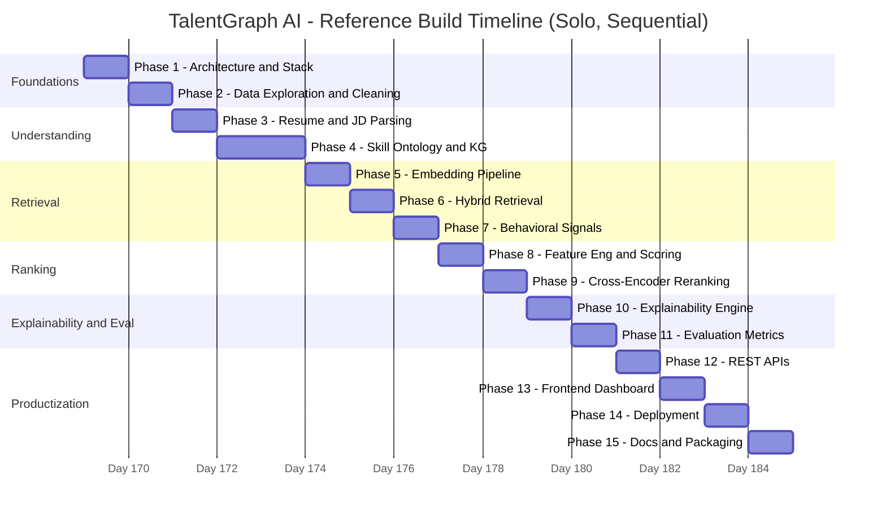

**Critical path (sequential):** Phase 1 → 2 → 3 → 4 → 5 → 6 → 8 → 9 → 10 → 12 → 13 → 14 → 15 (~13 days solo).
**Parallelizable side branches:** Phase 7 (behavioral signals) can run alongside Phase 6; Phase 11 (evaluation) can run alongside Phase 12 once Phase 9 is done.

---

## 6. Phase Dependency Graph

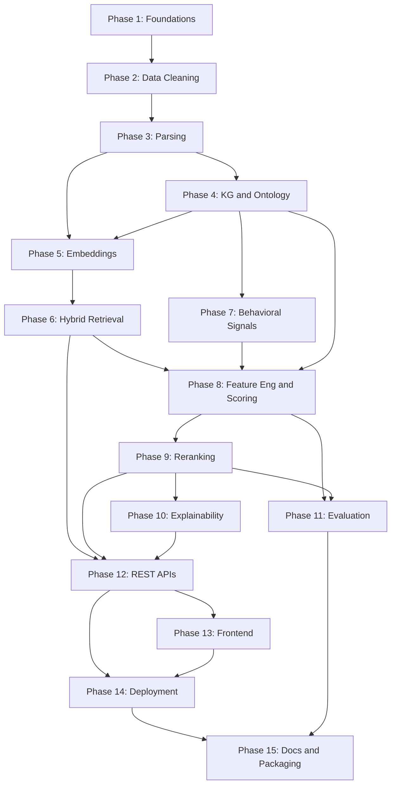

---

## 7. Git Branching & Commit Strategy

- **`main`** — protected, always demo-able. Only merges from `develop` at a milestone.
- **`develop`** — integration branch; all feature branches merge here first.
- **`feature/phaseN-short-name`** — one branch per phase (e.g. `feature/phase4-knowledge-graph`). Merge to `develop` via PR once that phase's acceptance criteria pass.
- **Commit style:** Conventional Commits — `feat:`, `fix:`, `test:`, `docs:`, `chore:`, `refactor:`. One commit per logical unit of work within a phase (not one giant commit per phase).
- **Merge strategy:** squash-merge feature branches into `develop` to keep history readable; merge `develop` → `main` at each milestone below.

---

## 8. Milestone Summary

| Milestone | After Phase | What's Demo-able |
|---|---|---|
| M1 | 2 | Clean, validated dataset with documented schema |
| M2 | 4 | Knowledge graph + skill ontology built and queryable |
| M3 | 6 | Hybrid retrieval returns a sensible top-100 for a sample job |
| M4 | 9 | Fully scored and reranked top-20 — core ranking engine complete |
| M5 | 11 | Quantified evaluation report proving the system beats the keyword baseline |
| M6 | 13 | End-to-end demo-able UI |
| M7 | 15 | Submission-ready repo, README, and ranked output file |

---

## 9. Submission Checklist Mapping *(updated against the real spec)*

| Organizer Requirement | Produced By |
|---|---|
| `submission.csv` — top 100, ranked, validator-clean | Phases 6–10, exported by `rank.py`; check with `validate_submission.py` |
| GitHub repo — code, `requirements.txt`, real commit history | Phases 1–14, plus the Git strategy in Section 7 |
| `submission_metadata.yaml` at repo root | Phase 15, copied from the provided template and filled honestly |
| Sandbox link (HF Spaces / Streamlit Cloud / Replit / Colab / Docker) | Phase 14 |
| Compute-budget compliance (5 min, 16GB, CPU-only, no network) | Section 0 — verify with an actual clean-machine timed run before submitting |
| Honeypot rate ≤10% in top 100 | Phase 7's `HoneypotDetector` |
| README with exact reproduce command | Phase 15 |
